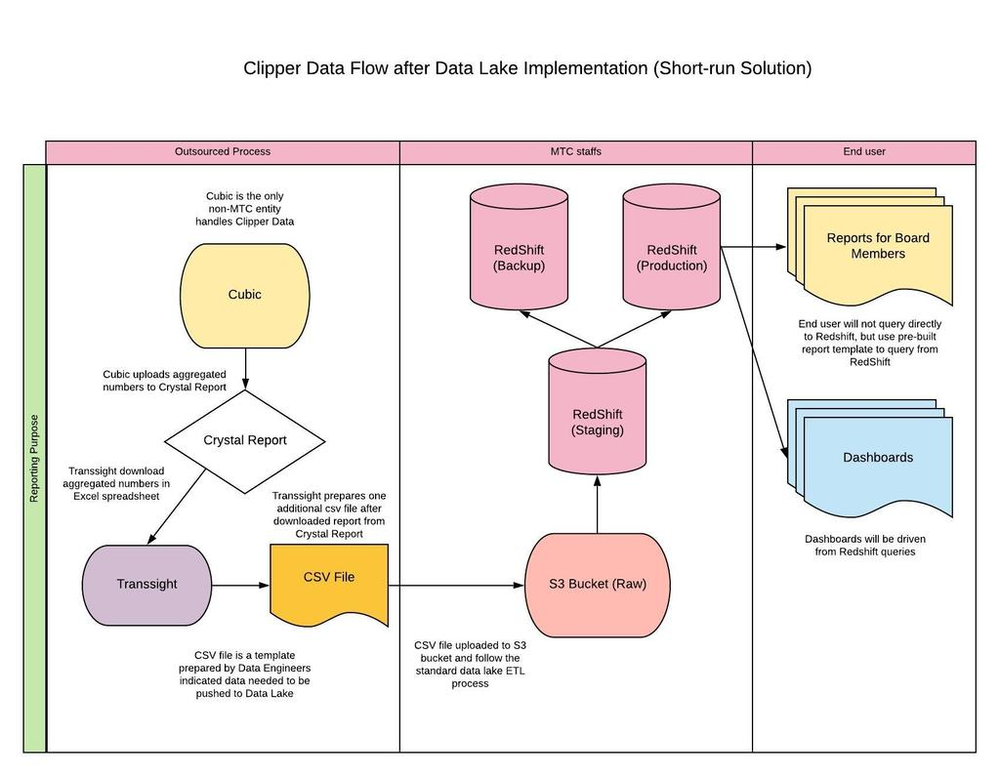
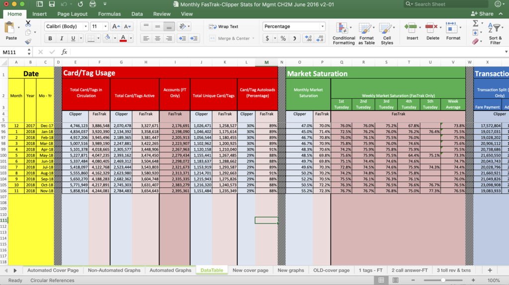

# Clipper Reporting Data ETL
Quinn Keck and Jacques Sham 

## Background
Quinn and Jacques

This documentation outlines the plan to transfer the Clipper reporting data from consultant to the Data Lake on Redshift, and the set up of ongoing ETL process to upload the clipper data to the Data Lake for short term. The goal is to set up a ETL work flow for the preparation of building dashboard for Clipper monthly reports. 

In the current structure, Cubic is the consultant who handles the operations of Clipper and collect the data on Clipper transactions. Cubic is responsible to provide accurate data for MTC for reporting and uploads the accurate aggregated data to Crystal Report. Gopi Purohit from Transsight is responsible to download and organize the reporting data on Excel and send to Lysa Hale in MTC. The work flow is shown below:

Figure 1 

Note that transaction data from Cubic are pipelined to two channels: Crystal Report and Clipper Data Store. Clipper Data Store stores the raw data of Clipper transactions but it was a business decision that Cubic is not providing credit card transactions. Since the data set in Clipper Data Store is not a full version, we cannot use the data in Clipper Data Store to build a dashboard for reporting purpose. Therefore, we can only rely on data from Crystal report. 

In the long run, the optimal data work flow should work as below:

Figure 2 

However, MTC have contract with both Cubic and Transsight, the optimal data work flow could not be implemented because we are not able to change the existing reporting structure in the short run. The suggested work flow should work as below: 

Figure 3 

## Persona
Cubic: The consultant and data steward of Clipper. Cubic handles all Clipper daily operations for MTC and periodically send Clipper data to MTC. Terry Smith is the contact person. 

Transsight: The consultant to generate reports and send to MTC. Gopi Purohit is the contact person. 

Data Engineers: Kearey Smith and USF interns, including Jacques Sham, Quinn Keck
 

EPS staffs: EPS staffs, including Lysa Hale, Mike Lee, Ed Meng
 

## Tools
S3 client - My S3 Browser 
Data Lake - AWS S3, AWS Redshift 
ETL - Trifacta, Matillion 

## CSV Template
The screenshot of the CSV (comma separated) template version 1, named "template_update.csv", is:

Figure 4 

The template consists of the following columns: 
* Month,Year,YrMo,Blank,Clipper_Total_Card_in_Circulation

* FasTrack_Total_Tags_in_Circulation,Clipper_Total_Card_Active,FasTrack_Total_Tags_Active,FasTrack_Accounts,Clipper_Total_Unique_Cards,FasTrack_Total_Unique_Tags

* Clipper_Card_AutoLoads,FasTrack_Tags_AutoLoads,Blank,Clipper_Monthly_Saturation,FasTrack_Monthly_Saturation,FasTrack_Saturation_1st_Tuesday,FasTrack_Saturation_2nd_Tuesday,FasTrack_Saturation_3rd_Tuesday

* FasTrack_Saturation_4th_Tuesday,FasTrack_Saturation_5th_Tuesday,FasTrack_Market_Sat_Weekly_Avgerage,Blank,Clipper_Fare_Payment_Transactions,Clipper_Add_Value_Payment_Transactions

* Clipper_Total_Transactions,FasTrack_Total_Transactions,FasTrack_Bridge_Only_Transactions_SFO,FasTrack_Bridge_Only_Transactions_I-680s,FastTrack_Bridge_Only_Transactions_SR-237,FasTrack_Bridge_Only_Transactions_I-580,FasTrack_Bridge_Only_Transactions_I-680
* Clipper_Revenue_By_Channel_AutoLoad_AddValue,Clipper_Revenue_By_Channel_Retailers,Clipper_Revenue_By_Channel_Ticket_Machines,Clipper_Revenue_By_Channel_Ticket_Office_Terminal,Clipper_Total_Revenue,FasTrak_Total_Revenue,Blank,Ciipper_Total_Calls,FasTrack_Total_Calls
* FasTrak_Abandoned_Calls_Number,FasTrak_Abandoned_Calls_Percent,Clipper_CRS_Calls_Handeled,FasTrak_CRS_Calls_Handeled,Clipper_IVR_Calls_Handled,FasTrak_IVR_Calls_Handled

* Clipper_Total_Calls_to_CSC,FastTrak_Total_Calls_to_CSC,Clipper_Total_CSC_Calls_to_CSR_Percent,FasTrak_Total_CSC_Calls_to_CSR_Percent,Clipper_Total_CSC_Calls_to_IVR_Percent

* FasTrak_Total_CSC_Calls_to_IVE_Percent,FasTrak_Percent_Calls_Done_in_60s,FasTrak_Percent_Calls_Done_in_180s,FasTrak_Average_Delay_Time_Seconds,FasTrak_Average_Talk_Time_Time_Seconds
 
 
that the columns order is identical to the format of "Copy of Copy of Monthly FasTrak-Clipper Stats for Mgmt CH2M May 2016 v2-01.xlsx", which looks like this:

Figure 5 

To prevent the confusion Gopi would have in the process, we decide the template that Gopi can be copy and paste from "Copy of Copy of Monthly FasTrak-Clipper Stats for Mgmt CH2M May 2016 v2-01.xlsx" and paste to "template_update.csv" and take away all format and colours.
 

The ideal file would have look like this: 

Figure 6 

An example could be found in "testing_clipper_hl.csv".
Note that the template intended to have Blank columns to fit the format from "Copy of Copy of Monthly FasTrak-Clipper Stats for Mgmt CH2M May 2016 v2-01.xlsx" and the data format of the template is supposed to be the same, so that it avoids Gopi to have extra work that may lead to format inconsistence. The data format is not consistent to Redshift but the work flow in Trifacta is going to reformat to match the data type in Redshift.
 

# Wrangling data
The ETL process will be done by Trifacta for this data set with standard ETL procedure in the [Data Lake Documentation.](https://github.com/BayAreaMetro/eps-projects/tree/master/data-lake/documentations) 

# Experiment Phase
We have built two work flow for experiment phase in order to create table, engineering the data type and push to Redshift. There are two work flow created for this purpose: 
1) Initiate Clipper Reporting Data to Staging 
2) Initiate Clipper Reporting Data to Lake 
that the work flow wrangles the data from S3 to Staging db and from Staging db to Lake, respectively.  

In order to wrangle data from S3 with schedule, the first step is to create a folder in the S3 bucket that you can parameterize on Trifacta. After that, transform the data on Trifacta. The data type used in these work flow should only contains integer, float, character, timestamp. Some of the columns came with string like "1,300,940" that Trifacta is not able to convert this to integer; on Trifacta, you are supposed to select this column and remove all symbol in order to get rid of the double quotation and comma and convert to integers. For the convenience in building dashboard, we shall make percentage data like 75.34% to 0.7534 instead. In order to do this on Trifacta, you should replace '%' with '' to get rid of the percentage symbol, then do the calculation operation to divide the column by 100. This type of columns should not be simply remove all symbol in order to preserve the decimal point. However, you are not allow to do the same division with different columns at the same time, therefore, you have repeat these two step on Trifacta on every column originally was percentage.  

## Date Types
Month, Year, YrMo were tricky to handle as date/time data type. For the convenience when building dashboard and simplicity, we have Month and Year in integer. YrMo will be in character because it created error when convert this to date/time type, and this is meant for data verification from human. We have to convert the date entry to timestamp. To do this, first concatenate month year to have MM/yyyy format in varchar. Then, convert date format to M/d/yyyy HH:mm:ss that would convert varchar to timestamp. This column will be useful if building a dashboard with time series charts.  

## Duplicates
If the upload file consists of two identical rows, Trifacta will upload the rows to Redshift without comparing them to see if they are duplicates.   If duplicate rows are upload to the table through Trifacta, the table will contain multiple versions of the same row.  If there’s duplicate files in an s3 bucket that is set up for automatic upload, Trifacta will also not detect that they are duplicates and upload to the table.

# Implementation Phase
We have built two work flow that is for production: 
1) Clipper Reporting to Staging, the table name in Staging is clipper_reporting 
2) Clipper Reporting to Lake, the table name in Lake is clipper_reporting 
that two work flows are to wrangle data from S3 to Staging and Staging to Lake. 
 

# The Validation Report
The validation report is built for data stewards to verify the data before pushing into lake. The dashboard is queried from the Staging database. The below link is the validation report for clipper_reporting in Staging. Once the data is approved, data engineers will manually push it into Lake. 
<a href="https://datastudio.google.com/u/0/reporting/1j4M2oTkqDEQCU41Jt9x8dVniS8DB8OMu/page/FLqo">Link here</a> 
Kearey, Jacques, and Quinn have the authority to edit, they may allow other users to edit.

# Pipeline Link
These work flow are built for production use. 
Automated work flow to ingest Clipper and Fastrak reporting data from S3 to Staging: 
<a href="https://mtc.trifacta.net/flows/146">Link here</a> 
Manual work flow to wrangle Clipper and Fastrak reporting data from Staging to Lake: 
<a href="https://mtc.trifacta.net/flows/147">Link here</a> 
