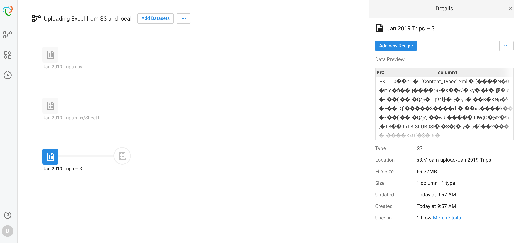
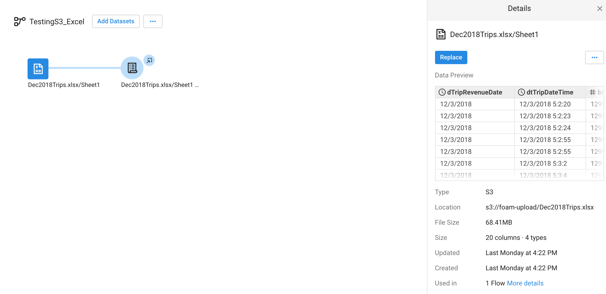

# BAIFA Data Transfer and ETL Setup

## Background
This documentation outlines the plan to upload the BAIFA data to the Data Lake on Redshift, and the set up of ongoing ETL process to upload the BAIFA data to the Data Lake moving forward. The goal is to centralize BAIFA data and thus to develop dashboard or tools for reporting and analysis. 

## Persona
FOAM staffs: Ken Hoang 
Data Engineers: Kearey Smith and USF interns, including Jacques Sham, Anastasia Keck

## Tools
BAIFA Store - Oracle SQL (Host by consultant) 
Data Lake - AWS S3, AWS Redshift
ETL - Trifacta

## Implementation Before Data Lake Project
Before the Data Lake Project implemented, there is no database to obtain the BAIFA data from. If BAIFA data is needed, it is required to request the data set from FOAM staffs. 
 
The BAIFA Store is hosted by the consultant. When MTC needs a data set, Ken make the ad-hoc request to the consultant to obtain the data set.

## Goal
The goal of this task includes: 
1. Have data stewards upload existing data in FOAM S3 buckets and ETL to Data Lake
2. Set up a procedure to have data stewards to upload BAIFA data onto S3 buckets and build a pipeline to transform the data into data warehouse
3. Create views or design and construct schema and table structure to improve performance for dashboard

## Transferring existing data
BAIFA data is the first data set that was uploaded to AWS Redshift from a tabular file uploaded in S3. Different with Clipper Data, the existing BAIFA data is also transfer via a tabular file to the data engineers. The files are stored in excel files and there are several difficulty to face: 

1. Trifacta did not handling excel files well
Trifacta was able to detect the excel files in S3 buckets but it did not upload the data set properly. In the first run, Trifacta was able to transform the data but fail to push the data into the staging database in Redshift. In the result of the transformation, there were a very small fraction of mismatch data in all columns in the excel file, except dTripRevenueData, dTripDataTime, biTripID, biTagNumber, vcPlate. We try to open the excel file with Pandas through Python, all the data we did not find any mismatch data structure in those mismatch columns, ie, the all data in those columns match the data structure and format. We believe that there were no mismatch values in the excel files. When we tried to wrangle the flow with excel files in different months, there were some excel files were encoded into non-human-readable special characters. The reply of Trifacta claimed that mishandling was to older version of Trifacta. At the same, Trifacta were not able to read excel files properly if the excel files are coming. 
  After we have asked Trifacta to update the version of Trifacta, it did not resolve the problem of excel files were encoded into non-human-readable special characters. We have to ask Trifacta Support to investigate it.

 

2. The dimension between the BAIFA table in Redshift and Excel files are inconsistent 
The wrangle in Trifacta for BAIFA throw errors every time we manually run it. We found out that the BAIFA table in Redshift has 20 columns while the excel files only have 17 columns for April, 2018 file, while October, November, December, 2018 and January, 2019 have 20 columns. The inconsistent dimension between the data warehouse and source files contribute the error. The solution is to ask Ken to get the full data set. Moving forward, we have to make sure data stewards to provide us the file in right dimension, 20 columns.
 

3. Errors throw when pushing data to Redshift 
When using Trifacta to wrangle the express lanes transactions to Redshift from excel files upload from local machine, there was error throw due to the inconsistent type and format of dttriprevenuedate. If we use Trifacta's default type on dttriprevenuedate, which is a datetime type with 'mm/dd/yyyy', redshift do not recognize the date type and prevent Trifacta to wrangle the data set to Redshift. We did experiment on pushing the column with varchar(256) to Redshift and use query to convert varchar to date on Redshift, Redshift could able to convert the characters to date type. Therefore, there is a problem to wrangle this column via Trifacta with date type.
 

Another problem we found out was an issue raised from Excel.  If you convert an excel file to csv file, the date time columns will be corrupted, ie, if the source data is '1/2/2019  5:02:49 AM' will become '02:29:00' which the convert loses the information that is not possible to retrieve. Therefore, it is the best either upload the data directly from Excel or csv file, but the best way is to have csv file to wrangle from. 

## Experiments
Before coming up with solutions, we have to verify the reason Trifacta not able to wrangle Excel files from S3 bucket is rooted from Excel files or S3 buckets. We have upload the Excel files directly from local machine and confirmed Trifacta did not have any error reading the data. However, the error of date format from dttriprevenuedate is also thrown. If we treat dttriprevenuedate as string, Trifacta was able to wrangle the data from Excel file to RedShift. Therefore, the encoding errors should be related to Trifacta not able to encode Excel files sourced from S3.
  

One possible solution is to convert the Excel files from .xlsx to .xls and save it on S3. When we tried to use Trifacta to wrangle the individual xls file in foam-upload, the data was encoded properly on Trifacta. However, the backfire is that not only dttriprevenuedate was not able to be pushed to RedShift as date type columns, so does not dtTripDateTime to be pushed to RedShift as timestamp. Due to the memory limitation of xls files is 26=65,536 rows that rows beyond row 65,546 are lost. The express lane data for October, 2018 has 785,244 rows in that xlsx file, that means there were only 3 days worth of day left after converting to xls file. If you want Trifacta to wrangle the directory as a directory on a scheduled flow, you have to create a folder and wrangle from that folder. However, Trifacta did not encode the xls files from a directory like wrangling xlsx files in S3 buckets.
 

The conclusion to this experiments is that both xls and xlsx are not an ideal format to wrangle from Trifacta. It is best to query from the data stewards' database and save as csv files and store on S3.

## Solutions Found
I. Encoding issue from Trifacta
We have consulted from Trifacta support about Trifacta was not able to encode Excel files from S3 properly. The reason is that the Excel files in the S3 buckets did not have an extension in the filename, ie, the file name was "Nov  2018 Trips_" where it is supposed to be "Nov2018Trips_.xlsx" to allow Trifacta to read the file properly.
 
With the same file, after adding the Excel extension, in S3 bucket, Trifacta was able to encode the characters in the Excel file properly. 

 
In the SOP of data stewards to upload data set onto S3 buckets, there should be a guideline to instruct how the filename and file format should be. The filename should not contain whitespace and special characters and should end with a proper extension when upload that file onto S3 bucket.
If there is any future technical issue, one should email to <b>support@trifacta.com</b>